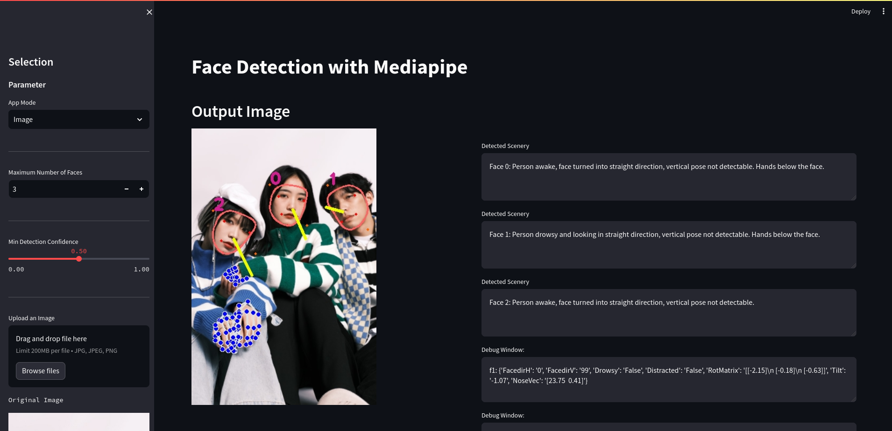

# VisualAI - Textual Facedetection
**Python Version used:** 3.11.4
## A) Installation
### 1. Python Environment
A virtual environment is a Python environment such that the Python interpreter, libraries and scripts installed into it are isolated from those installed in other virtual environments.
#### Windows:
**Prerequisites:** Installation of the latest Python version from here:
 - https://www.python.org/downloads/windows/
and and the Pip installer from here:
 - https://phoenixnap.com/kb/install-pip-windows
Then Install **pyenv for Windows**
>pip install pyenv-win
#### Linux:
- Install and update dependencies:
> sudo apt update -y

> sudo apt install -y make build-essential libssl-dev zlib1g-dev libbz2-dev libreadline-dev libsqlite3-dev wget curl llvm libncurses5-dev libncursesw5-dev xz-utils tk-dev libffi-dev liblzma-dev python-openssl git

- Prerequisites: Installation of the latest Pyenv version from here:
> curl https://pyenv.run | bash

Update .bashrc:
> echo 'export PYENV_ROOT="$HOME/.pyenv"'  >> ~/.bashrc
> echo 'export PATH="$PYENV_ROOT/bin:$PATH"'  >> ~/.bashrc
> echo -e 'if command -v pyenv 1>/dev/null 2>&1; then\n eval "$(pyenv init -)"\nfi'  >> ~/.bashrc

**Setting up the Virtual Environment:**
(1) Check pyenv version
> pyenv versions

(2) Install Python
> pyenv install 3.11.4

(3) Set this version local
> pyenv local 3.11.4

(4) Install **virtualvenv**
> python -m pip install virtualenv

(5) Create your environment
> pyenv virtualenv 3.11.4 visionai

> pyenv activate visionai

### 2. VisualAI installation
> mkdir ~/workspace/

> pip install -r requirements.txt

> cd ~/workspace/VisualAI

### 3. Running VisualAI
> streamlit run facedetection.py

**Installing Dependencies:**
After activating the environment:
>pip install -r requirements.txt

### 3. Running VisualAI
> streamlit run facedetection.py

**Installing Dependencies:**
After activating the environment:
>pip install -r requirements.txt
### 4. Usage
**Startup Screen**
- It starts up with image processing. You can upload images from ./images/persons. Some examples can be found here. An evaluation document can be found here [drvmonpics.doc](./images/drvmonpicsdoc.odt)
- Selecting **video**, a demo video is started. You can also upload videos form ./video/persons. If pressing the webcam button, the frames of a USB Webcam are shown and processed.

**Demo Video**
- To see the application in action, check out our demo video: [View Demo](./demo.webm)
> Written with [StackEdit](https://stackedit.io/).
